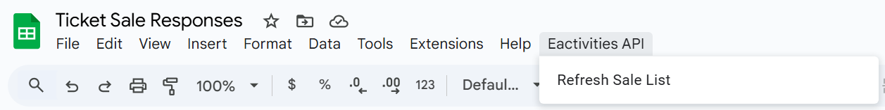

# pdf-attacher
Takes a pdf and splits it into individual pages, then attaches each page to a personalised email. Created to do ticketing for ArtSoc at Imperial College London.

Inspired by
[seat-distributor](https://github.com/Tuna521/seat-distributor)
and [auto-email_sender](https://github.com/Tuna521/auto-email-sender)

## Directory contents:
1. `sheets_api` - This is a duplicate of what is in the [google sheet](https://docs.google.com/spreadsheets/d/1YkI87ppHrBJbf1xaVx_z2ahNnC4g7KRi7rIMc45S0NU/edit?gid=1776015280#gid=1776015280) without the API codes (this can be found in Union eactivities website). 

Open Extensions > Apps Script in your google sheet and put under files. Once saved, the button will appear in the tab bar as "Eactivities API > Refresh Sale List".



This reads data from the the Imperial union shop without having to download the excel sheet every time. 

2. `pdf_split.py` - Splits a pdf into individual pages and renames them `show_seat_name` (can be changed in output_filename)

3. `sender_windows.py` or `sender_mac.py` - Creates draft email and attaches pdf files from `output_tickets` to each one. Email contents can be changed in `templates`.

2. `artsoc.bat` or `artsoc_mac.sh` - Splits pdf into individual tickets and attaches them to email. Email drafts will be created in the outlook app.

## Prequisites 

Clone the repo:
```
git clone https://github.com/bethcham/artsoc-pdf-attacher.git
pip3 install PyPDF2
```

For Windows only: 
```
pip3 install pywin32
```

For Mac only: 
```
pip3 install appscript
```

## Running
1. Save tickets under `tickets.pdf`
2. In `shop.csv`, copy contents from either the Purchase Summary / google sheets / any form you choose, as long as the following columns are present: `Quantity, First Name, Surname,	Email, Seat 1, Seat 2, Seat N...`

### On Windows:
3. Run 
```
./artsoc.bat
```
Ensure you are signed in to the correct email (can be changed in `sender_windows.py`) and follow instructions

4. Go to outlook (works better if you use the app on your computer, otherwise it takes a while to load), and the emails will be saved as drafts there. Check through and send. 

### On Mac:
3. Run 
```
./artsoc_mac.sh
```
Ensure you are signed in to the correct email (can be changed in `sender_mac.py`) and follow instructions

4. Go to outlook (works better if you use the app on your computer, otherwise it takes a while to load), and the emails will be saved as drafts there. Check through and send. 


### Some warnings:
1. You must ensure that the order of the tickets in `tickets.pdf` matches in `shop.csv`. This is **usually** provided in alphanumerical order, but not always. 
2. Manually add seat allocations in the format 'Seat 1', 'Seat 2', ... as separate columns. This is case sensitive. Seat 2 onwards can be left out if not needed. 

